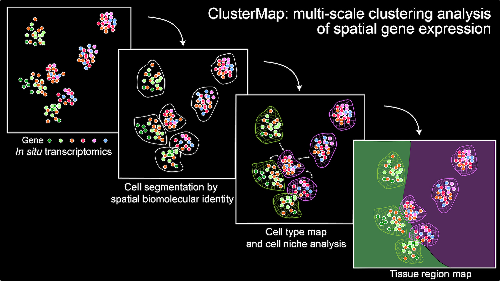

# ClusterMap

This repository contains an available tool for ClusterMap for multi-scale clustering analysis of spatial gene expression, and ClusterMap examples of the 3D STARmap human cardiac organoid dataset, 2D STARmap mouse brain V1 dataset, and 3D STARmap mouse brain V1 dataset.

- **Original scripts for generating data at ClusterMap paper are at: https://codeocean.com/capsule/9820099/tree/v1.**

- **STARmap placenta dataset can be accessed at [here](./datasets/STARmap_placenta/README.md).**

- **Raw fluorescent imaging data can be accessed at [here](./datasets/RawImage/README.md).**

***
 

***

 

### Install

> git clone https://github.com/wanglab-broad/ClusterMap.git
> 
> cd ClusterMap
> 
>pip install -e.

For the environment, to use .yml file:
`conda env create -f environment.yml`. This will create an environment named ClusterMap with required packages.
***

 

### Tutorial

- We are currently uploading more files for packaging and testing and will finish update soon.
- Read a more detailed tutorial [here](./Tutorial.md).

#### Basics

**Input data**

- `spots`: data matrix of mRNA spots with 2D/3D physical location and gene identity information (pandas dataframe)
  - Example

| Index | spot_location_1 | spot_location_2 | spot_location_3 | gene | Optional other info: gene_name |
| ----- | :-------------: | :-------------: | :-------------: | :--: | :----------------------------: |
| 0     |       105       |       239       |        1        |  1   |            Syndig1l            |
| 1     |       110       |       243       |        1        |  1   |            Syndig1l            |
| 2     |       115       |       178       |        1        |  2   |             Acot13             |

- `dapi`: a 2D/3D image corronsponding to `spots`

**Input Parameters**

- `xy_radius`: estimation of radius of cells in x-y plane

- `z_radius`: estimation of radius of cells in z axis; 0 if data is 2D.

- `cell_num_threshold`:  a threshold for deciding the number of cells. A larger value gives more cells; Default: 0.1.

- `dapi_grid_interval`: sample interval in DAPI image. A large value will consume more computation resources and give more accurate results (most of the time). Default: 3.

**Output parameters**

- `model.cellid_unique`: unique cell id values

- `model.cellcenter_unique`:  cell centers in order of `model.cellid_unique`

#### 

#### Analysis on STARmap 2D V1 1020-gene sample

- Example file at `ClusterMap_STARmap_human_cardiac_organoid.ipynb`

#### Analysis on STARmap human cardiac sample

- Example file at `ClusterMap_STARmap_V1_1020.ipynb`

#### Analysis on STARmap 3D V1 28-gene sample

#### Time estimation

- Time is dependent on the number of input spots, and potentially the area the DAPI foreground. Currently testing on several samples: 
  - 1mins 42s for 49,712 input spots (all 273,242 spots) without GPU, single thread
  - 34mins 53s for 471,295 input spots without GPU, single thread

***

 

### Other Info

#### Citation

If you find ClusterMap useful for your work, please cite our paper: 

> He, Y., Tang, X., Huang, J. et al. ClusterMap for multi-scale clustering analysis of spatial gene expression. Nat Commun 12, 5909 (2021). https://doi.org/10.1038/s41467-021-26044-x

#### Contact

Contact us at clustermap.issue@gmail.com if you have any issues.

#### Contributor
[Yichun He](https://github.com/heihaizhengdong), 
[Emma Bou Hanna](https://github.com/EmmaBouhanna), 
[Jiahao Huang](https://github.com/jiahaoh), 
[Xin Tang](https://github.com/xintangg)
[Haowen Zhou](https://github.com/Pixel-Dream)
